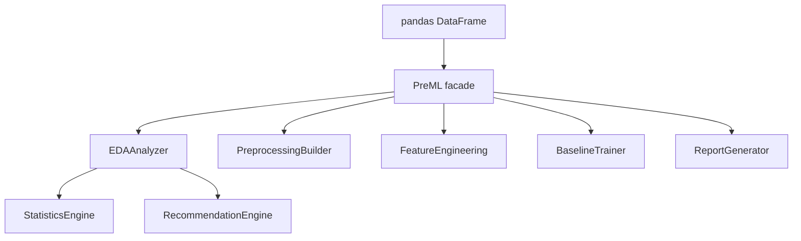

# PreML Usage Guide

## PreML

> **PreML** is a production-ready Python library for automating the most repetitive stages of tabular machine learning workflows. It performs exploratory data analysis (EDA), statistical profiling, preprocessing pipeline generation, feature engineering recommendations, baseline model evaluation, visualization, and professional report generation—all while remaining transparent, configurable, and fully compatible with the Scikit-learn ecosystem.
>
> Unlike many automated machine learning tools, **PreML** does not rely on opaque heuristics. Every recommendation is derived from statistical evidence, enabling reproducible, explainable, and trustworthy machine learning workflows.

PreML is an evidence-driven library for tabular ML workflows.

The recommended starting point is the high-level facade:

```python
from preml import PreML

ml = PreML(df, target="target")
analysis = ml.analyze()
report = ml.report()
pipeline = ml.pipeline()
```

Advanced users can still drop down to `EDAAnalyzer`, `StatisticsEngine`, and `RecommendationEngine`, but the facade should be the default starting point.

This guide is the authoritative reference for the current implementation.

## Contents

<ul>
    <li><a href="#philosophy-and-design-goals">Philosophy and Design Goals</a></li>
    <li><a href="#installation-and-compatibility">Installation and Compatibility</a></li>
    <li><a href="#architecture-and-data-flow">Architecture and Data Flow</a></li>
    <li><a href="#which-component-should-i-use">Which Component Should I Use?</a></li>
    <li><a href="#quick-start">Quick Start</a></li>
    <li><a href="#core-workflow-end-to-end">Core Workflow (End-to-End)</a></li>
    <li>
        <a href="#api-reference">API Reference</a>
        <ul>
            <li><a href="#preml-eda">preml.eda</a></li>
            <li><a href="#preml-statistics-engine">preml.statistics_engine</a></li>
            <li><a href="#preml-recommendation-engine">preml.recommendation_engine</a></li>
            <li><a href="#preml-preprocessing">preml.preprocessing</a></li>
            <li><a href="#preml-feature-engineering">preml.feature_engineering</a></li>
            <li><a href="#preml-model-utils">preml.model_utils</a></li>
            <li><a href="#preml-visualization">preml.visualization</a></li>
            <li><a href="#preml-report">preml.report</a></li>
        </ul>
    </li>
    <li><a href="#configuration-reference">Configuration Reference</a></li>
    <li><a href="#typical-workflows">Typical Workflows</a></li>
    <li><a href="#error-handling-and-troubleshooting">Error Handling and Troubleshooting</a></li>
    <li><a href="#faq">FAQ</a></li>
    <li><a href="#best-practices">Best Practices</a></li>
    <li><a href="#performance-and-scalability-guidance">Performance and Scalability Guidance</a></li>
    <li><a href="#pipeline-persistence">Pipeline Persistence</a></li>
    <li><a href="#sklearn-integration-notes">sklearn Integration Notes</a></li>
    <li><a href="#migration-notes">Migration Notes</a></li>
    <li>
        <a href="#detailed-component-guides">Detailed Component Guides</a>
        <ul>
            <li><a href="#edaanalyzer">EDAAnalyzer</a></li>
            <li><a href="#statisticsengine">StatisticsEngine</a></li>
            <li><a href="#recommendationengine">RecommendationEngine</a></li>
            <li><a href="#visualization">Visualization</a></li>
            <li><a href="#preprocessingbuilder">PreprocessingBuilder</a></li>
            <li><a href="#featureengineering">FeatureEngineering</a></li>
            <li><a href="#baselinetrainer">BaselineTrainer</a></li>
            <li><a href="#reportgenerator">ReportGenerator</a></li>
        </ul>
    </li>
    <li><a href="#end-to-end-workflow">End-to-End Workflow</a></li>
    <li><a href="#performance">Performance</a></li>
    <li><a href="#thread-safety">Thread Safety</a></li>
    <li><a href="#reproducibility">Reproducibility</a></li>
    <li><a href="#license">License</a></li>
</ul>

## Philosophy and Design Goals

PreML is designed to be transparent, not black-box automation.

- Every recommendation includes evidence.
- Statistical computation is separate from decision logic.
- Preprocessing is sklearn-compatible.
- Modules are composable: use only what you need.

## Installation and Compatibility

### Requirements

- Python: 3.9+
- pandas: >=1.5.0,<3.0.0
- numpy: >=1.23.0,<3.0.0
- scipy: >=1.9.0,<2.0.0
- matplotlib: >=3.7.0,<4.0.0
- seaborn: >=0.12.0,<1.0.0
- scikit-learn: >=1.2.0,<2.0.0

### Install from PyPI

```bash
pip install pypreml
```

### Install from source

```bash
git clone https://github.com/pqun7/preml.git
cd preml
python -m pip install -e .
```

## Architecture and Data Flow



### Module Responsibilities

- `preml.PreML`: facade that lazily caches analysis and exposes common workflows.
- `preml.statistics_engine.StatisticsEngine`: computes facts only.
- `preml.recommendation_engine.RecommendationEngine`: converts facts to recommendations.
- `preml.eda.EDAAnalyzer`: orchestrates analysis and quality scoring.
- `preml.preprocessing.PreprocessingBuilder`: builds and applies sklearn preprocessing.
- `preml.feature_engineering.FeatureEngineering`: suggests engineered features.
- `preml.model_utils.BaselineTrainer`: evaluates baseline models.
- `preml.report.ReportGenerator`: emits text/markdown/html reports.
- `preml.visualization`: plotting utilities and explanation helpers.

## Which Component Should I Use?

Use this decision tree:

1. I just need a one-call analysis result:
    - Use `from preml import analyze` or `PreML(df).analyze()`
2. I need a reusable high-level object:
    - Use `PreML(df, target=...).report()` or `PreML(df, target=...).pipeline()`
3. I need orchestration + summary method:
    - Use `EDAAnalyzer(df, target=...).run()`
4. I only need statistical facts:
    - Use `StatisticsEngine(df, target=...).run_full_analysis()`
5. I need empirical model selection from raw tabular features:
    - Use `RecommendationEngine(...).fit(X, y)`
    - Catch `ValidationTimeoutError` if the time budget is exceeded.
6. I need recommendations from existing stats:
    - Use `RecommendationEngine().generate_recommendations(stats)`
7. I need sklearn preprocessing from analysis:
    - Use `PreprocessingBuilder(analysis)`
8. I need baseline model evaluation:
    - Use `BaselineTrainer` with preprocessing pipeline.

## Quick Start

```python
import numpy as np
import pandas as pd

from preml import PreML, analyze

# 1) Load data
rng = np.random.default_rng(42)
df = pd.DataFrame(
    {
        "LotArea": rng.normal(8000, 1500, 100),
        "OverallQual": rng.integers(3, 10, 100),
        "Neighborhood": rng.choice(["A", "B", "C"], 100),
        "SalePrice": rng.normal(200000, 40000, 100),
    }
)

# 2) Analyze through the facade
ml = PreML(df, target="SalePrice")
analysis = ml.analyze()
print(ml.summary())

# One-line shortcut for quick scripts
analysis2 = analyze(df, target="SalePrice")

# 3) Build preprocessing
builder = ml.pipeline()
X_train = df.drop(columns=["SalePrice"])
X_transformed = builder.fit_transform(X_train)

# 4) Transform future data with same fitted builder
X_new = builder.transform(X_train.head(5))

print(X_transformed.shape)
```

## Core Workflow (End-to-End)

```python
import numpy as np
import pandas as pd

from preml import PreML
from preml.model_utils import BaselineTrainer

# Data
rng = np.random.default_rng(42)
df = pd.DataFrame(
    {
        "LotArea": rng.normal(8000, 1500, 100),
        "OverallQual": rng.integers(3, 10, 100),
        "Neighborhood": rng.choice(["A", "B", "C"], 100),
        "SalePrice": rng.normal(200000, 40000, 100),
    }
)

# Analyze
ml = PreML(df, target="SalePrice")
analysis = ml.analyze()
print(ml.summary())

# Preprocess
preprocessor = ml.pipeline().build_pipeline()

# Baseline models
trainer = BaselineTrainer()
results = trainer.train_baselines(
    analysis_result=analysis,
    df=df,
    target_col="SalePrice",
    preprocessing_pipeline=preprocessor,
    cv=5,
)

for row in results:
    print(row["model_name"], row["mean_scores"])
```

## API Reference

<a id="preml-eda"></a>
### `preml.eda`

#### `PreML(df, target=None, config=None, enable_feature_engineering=True)`

Primary user-facing facade.

- `analyze() -> dict`: run and cache analysis.
- `summary() -> str`: text summary.
- `recommendations() -> dict`: cached recommendation bundle.
- `pipeline() -> PreprocessingBuilder`: preprocessing builder from cached analysis.
- `report(format="text") -> str | Report output`
- `visualize(kind="all") -> dict`
- `feature_engineering() -> list`
- `models(X=None, y=None) -> dict`

#### `EDAAnalyzer(df, target=None, config=None, enable_feature_engineering=True)`

Main orchestrator.

- `run() -> dict`: executes full analysis.
- `summary() -> str`: text summary.

Return keys from `run()`:

- `metadata`
- `duplicates`
- `infinite`
- `missing`
- `outliers`
- `feature_profiles`
- `correlation_pairs`
- `target_profile`
- `recommendations`
- `data_quality_score`
- `data_quality_notes`

#### `analyze(df, target=None, config=None, enable_feature_engineering=True) -> dict`

Convenience wrapper around `PreML(...).analyze()`.

#### `quick_eda(df, target=None) -> dict`

Backward-compatible alias for `analyze(...)`.

<a id="preml-statistics-engine"></a>
### `preml.statistics_engine`

#### `StatisticsEngine(df, target=None, config=None)`

Key methods:

- `compute_dataset_metadata()`
- `compute_duplicate_report()`
- `compute_infinite_report()`
- `compute_missing_report()`
- `compute_outlier_report()`
- `compute_feature_profiles()`
- `compute_correlation_pairs()`
- `compute_target_profile()`
- `run_full_analysis()`

Behavior note:

- If `target` is provided, the target column is excluded from `feature_profiles`.

<a id="preml-recommendation-engine"></a>
### `preml.recommendation_engine`

#### `RecommendationEngine(config=None, knowledge_db_path="knowledge.db", random_state=None, enable_meta_learning=True, enable_feature_engineering=None)`

- `fit(X, y, time_budget_seconds=120.0, progress_callback=None)`
- `get_recommendation(X, y)`
- `generate_recommendations(analysis_results)`
- `summarize(recommendations)`

`fit(..., progress_callback=...)` calls the callback as `progress_callback(step, payload)`.
The callback is triggered at the start of the run, after each major phase,
and once more at completion. The `payload` argument is always a dictionary.

`fit()` may raise `ValidationTimeoutError` if the configured time budget is
exceeded during model screening or tuning. In that case, you can either increase
`time_budget_seconds` or fall back to heuristic recommendations using
`get_recommendation(X, y)`.

Expected analysis input keys include:

- `duplicates`, `infinite`, `missing`, `outliers`, `feature_profiles`, `correlation_pairs`, `target_profile`

For empirical selection, pass the raw feature matrix and target vector to `fit()`.
For descriptive recommendations, pass the analysis dictionary returned by
`EDAAnalyzer.run()` or `quick_eda()` to `generate_recommendations()`.

<a id="preml-preprocessing"></a>
### `preml.preprocessing`

#### `PreprocessingBuilder(analysis_result, config=None)`

Builds sklearn-compatible preprocessing.

Methods:

- `build_pipeline() -> ColumnTransformer`
- `fit(df) -> PreprocessingBuilder`
- `transform(df) -> np.ndarray`
- `fit_transform(df) -> np.ndarray`

Important rules:

- Pass feature DataFrames only (exclude target column).
- `transform` requires prior `fit` or `fit_transform`.

<a id="preml-feature-engineering"></a>
### `preml.feature_engineering`

#### `FeatureEngineering(analysis_result, df=None, config=None)`

- `suggest_features() -> List[Recommendation]`

Suggestion categories include ratio, interaction, binning, power transform, datetime extraction, and categorical crossing where statistically justified.

If `df` is omitted, datetime-based feature suggestions are skipped because the
engine only uses the analysis result and does not recompute dataset-level facts.

<a id="preml-model-utils"></a>
### `preml.model_utils`

#### `compute_metrics(y_true, y_pred, task_type, extra_metrics=None)`

Returns metric dictionary.

#### `cross_validate(model, X, y, cv=5, scoring="r2", random_state=None, n_jobs=-1)`

Returns metric -> fold-score lists.

#### `BaselineTrainer(config=None)`

Methods:

- `build_model_pipeline(preprocessing_pipeline, task_type, estimator=None)`
- `evaluate_baseline(pipeline, X, y, task_type, cv=5, scoring=None)`
- `train_baselines(analysis_result, df, target_col, preprocessing_pipeline, cv=5)`

`evaluate_baseline` output keys:

- `cv_scores`
- `mean_scores`
- `std_scores`
- `pipeline`

<a id="preml-visualization"></a>
### `preml.visualization`

Key plotting APIs:

- `plot_numeric_distributions(...)`
- `plot_target_distribution(...)`
- `plot_correlation_heatmap(...)`
- `plot_top_correlations_bar(...)`
- `plot_missing_heatmap(...)`
- `plot_outlier_summary(...)`
- `plot_target_correlations(...)`
- `explain_visualizations(...)`

<a id="preml-report"></a>
### `preml.report`

#### `ReportGenerator(analysis_result, df=None, config=None)`

Methods:

- `generate_text()`
- `generate_markdown()`
- `generate_html(embed_plots=True)`
- `save_report(filepath, format="html", embed_plots=True)`

Supported formats in `save_report`:

- `html`
- `md` or `markdown`
- `txt` or `text`

## Configuration Reference

Use `MLToolkitConfig` to tune behavior:

```python
from preml.config import MLToolkitConfig

cfg = MLToolkitConfig(
     missing_threshold=0.25,
     correlation_threshold=0.8,
     skewness_threshold=1.0,
     outlier_method="iqr",
     high_cardinality_threshold=50,
     max_unique_for_categorical_like=15,
     random_state=42,
     n_jobs=-1,
)
```

### Adaptive configuration

```python
cfg = MLToolkitConfig().adapt_to_dataset(df)
```

This adjusts selected thresholds based on dataset size/shape profile.

## Typical Workflows

### 1) Analysis only

```python
from preml.eda import EDAAnalyzer

analysis = EDAAnalyzer(df, target="target").run()
```

### 2) Recommendation only from precomputed stats

```python
from preml.statistics_engine import StatisticsEngine
from preml.recommendation_engine import RecommendationEngine

stats = StatisticsEngine(df, target="target").run_full_analysis()
recs = RecommendationEngine().generate_recommendations(stats)
```

Use this path when you already have an analysis dictionary and want human-readable
recommendations for imputation, encoding, scaling, feature selection, and model
ranking without re-running the statistical analysis.

### 3) Empirical model selection from raw features

```python
import numpy as np
import pandas as pd

from preml.recommendation_engine import RecommendationEngine, ValidationTimeoutError

rng = np.random.default_rng(42)

df = pd.DataFrame(
    {
        "feature1": rng.normal(size=180),
        "feature2": rng.normal(size=180),
        "category": rng.choice(["A", "B", "C"], 180),
    }
)
y = df["feature1"] * 0.5 + df["feature2"] * 0.3 + rng.normal(scale=0.1, size=180)

engine = RecommendationEngine(random_state=42)
try:
    result = engine.fit(df, y, time_budget_seconds=60)
    print(engine.summarize(result))
    post_fit = engine.get_recommendation(df, y)
except ValidationTimeoutError:
    print("Empirical validation timed out. Falling back to heuristic recommendation.")
    post_fit = engine.get_recommendation(df, y)

print(post_fit["model"])
print(post_fit["cv_score"])
print(post_fit["pipeline"])
```

This path is the right choice when you want the engine to actually evaluate
models on your data and return the best validated pipeline. `fit()` performs the
full empirical workflow, while `get_recommendation()` reuses the fitted result.

You can also use `get_recommendation(df, y)` before calling `fit()` if you only
want a fast heuristic suggestion, but the returned `cv_score` and `pipeline`
will be `None` in that mode.

### 4) Preprocess train/test split

```python
from sklearn.model_selection import train_test_split
from preml import quick_eda
from preml.preprocessing import PreprocessingBuilder

train_df, test_df = train_test_split(df, test_size=0.2, random_state=42)
analysis = quick_eda(train_df, target="target")

builder = PreprocessingBuilder(analysis)
X_train = train_df.drop(columns=["target"])
X_test = test_df.drop(columns=["target"])

builder.fit(X_train)
X_train_t = builder.transform(X_train)
X_test_t = builder.transform(X_test)
```

### 5) Report generation

```python
from preml import quick_eda
from preml.report import ReportGenerator

analysis = quick_eda(df, target="target")
report = ReportGenerator(analysis, df=df)

report.save_report("reports/eda", format="html", embed_plots=True)
report.save_report("reports/eda", format="md")
report.save_report("reports/eda", format="txt")
```

## Error Handling and Troubleshooting

PreML raises domain-specific exceptions:

- `DataValidationError`
- `RecommendationError`
- `PreprocessingError`
- `ModelError`
- `ReportError`
- `VisualizationError`

Common issues:

1. `PreprocessingBuilder is not fitted`
    - Fix: call `builder.fit(df)` before `builder.transform(df)`.
2. Missing feature columns during transform
    - Fix: ensure input columns match non-constant columns from `feature_profiles`.
3. Target column not found
    - Fix: pass exact target name or set `target=None`.
4. Empty DataFrame validation error
    - Fix: provide at least one row and one column.

## FAQ

1. Should I use `quick_eda` or `EDAAnalyzer`?
    - Use `quick_eda` for concise scripts and `EDAAnalyzer` when you also want `summary()` and analyzer object lifecycle.

2. Why is target not in `feature_profiles`?
    - Target is intentionally excluded from feature profiling to prevent leakage into preprocessing.

3. Does `PreprocessingBuilder` return sparse matrices?
    - No. The current implementation returns dense NumPy arrays.

4. How do I transform new data consistently?
    - Fit once (`fit` or `fit_transform`) then call `transform` on future data.

## Best Practices

- Analyze on training data only.
- Exclude target column before preprocessing transformation.
- Persist fitted preprocessing and model together.
- Keep one shared config object per experiment for consistency.
- Validate generated recommendations against domain constraints.

## Performance and Scalability Guidance

- Use `n_jobs=-1` for parallel CV where appropriate.
- Reduce plotting load with `max_plot_cols`.
- For very large datasets, call `adapt_to_dataset` to tighten defaults.
- Limit report embedding if HTML size becomes large (`embed_plots=False`).

## Pipeline Persistence

```python
import joblib

# After fitting
joblib.dump(builder, "artifacts/preprocessor_builder.joblib")

# Later
builder_loaded = joblib.load("artifacts/preprocessor_builder.joblib")
X_new = builder_loaded.transform(new_df)
```

## sklearn Integration Notes

- `PreprocessingBuilder.build_pipeline()` returns a `ColumnTransformer`.
- Use with estimators in `sklearn.pipeline.Pipeline`.
- `BaselineTrainer` can attach estimators and run cross-validation.

## Migration Notes

If you are upgrading from earlier docs/examples:

- Use `EDAAnalyzer.run()` as canonical analysis entrypoint.
- `PreprocessingBuilder` supports `fit`, `transform`, and `fit_transform`.
- Use `evaluate_baseline` output key `cv_scores` (not `fold_scores`).
- Install package as `pypreml` from PyPI.

## License

MIT License.

Each component has a well-defined responsibility and communicates through standardized data structures, making the library easy to extend, test, and integrate into existing projects.

The typical workflow is illustrated below:

```text
                Dataset
                    │
                    ▼
             EDAAnalyzer
                    │
     ┌──────────────┼──────────────┐
     ▼              ▼              ▼
Statistics   Recommendations   Data Quality
     │              │
     └──────────────┘
             │
             ▼
   PreprocessingBuilder
             │
             ▼
   FeatureEngineering
             │
             ▼
    BaselineTrainer
             │
             ▼
    ReportGenerator
```

---

## Detailed Component Guides

# EDAAnalyzer

## Overview

`EDAAnalyzer` is the primary entry point of PreML.

It orchestrates the complete exploratory data analysis (EDA) workflow by combining statistical analysis, data quality assessment, feature profiling, and evidence-based recommendation generation into a single interface.

Rather than exposing multiple independent analysis steps, `EDAAnalyzer` executes them in a consistent order and aggregates the results into a unified analysis object that can be consumed by every other component in the library.

Because every downstream component relies on the same analysis dictionary, statistics are computed only once and reused throughout the workflow.

---

## Responsibilities

`EDAAnalyzer` automatically performs the following tasks:

- Computes dataset metadata.
- Detects duplicate rows.
- Detects missing values.
- Detects infinite values.
- Detects numerical outliers using configurable methods.
- Profiles numerical features.
- Profiles categorical features.
- Analyzes the target variable.
- Computes feature correlations.
- Generates preprocessing recommendations.
- Calculates an overall data quality score.
- Produces human-readable data quality notes.

---

## Basic Example

```python
# Import the analyzer
from preml.eda import EDAAnalyzer

# Create the analyzer
analyzer = EDAAnalyzer(

    # Input dataset
    df,

    # Optional target column
    target="price",
)

# Execute the complete analysis pipeline
analysis = analyzer.run()
```

After calling `run()`, all statistical analyses are completed and stored inside a single dictionary that can be reused throughout the rest of the workflow.

---

## Returned Object

The analyzer returns a dictionary containing all generated analysis results.

```python
analysis: dict[str, Any]
```

The most commonly used keys include:

| Key | Description |
|------|-------------|
| `metadata` | General dataset information. |
| `duplicates` | Duplicate row analysis. |
| `infinite` | Infinite value report. |
| `missing` | Missing-value statistics. |
| `outliers` | Outlier detection results. |
| `feature_profiles` | Numerical and categorical feature profiles. |
| `correlation_pairs` | Significant feature correlations. |
| `target_profile` | Target variable analysis. |
| `recommendations` | Evidence-based preprocessing recommendations. |
| `data_quality_score` | Overall dataset quality score. |
| `data_quality_notes` | Human-readable quality assessment. |

---

## Accessing Individual Results

Since the analysis output is a standard Python dictionary, individual reports can be accessed directly.

```python
# Retrieve dataset metadata
metadata = analysis["metadata"]

# Retrieve missing-value statistics
missing = analysis["missing"]

# Retrieve detected outliers
outliers = analysis["outliers"]

# Retrieve preprocessing recommendations
recommendations = analysis["recommendations"]

# Retrieve the overall quality score
quality_score = analysis["data_quality_score"]
```

This design keeps the API intuitive while allowing each downstream component to reuse existing statistical results without recomputation.

---

## Generating a Summary

A concise textual summary can be generated at any time.

```python
# Print a human-readable summary
print(
    analyzer.summary()
)
```

The generated summary typically includes:

- Dataset dimensions.
- Missing-value overview.
- Duplicate statistics.
- Outlier summary.
- Correlation highlights.
- Data quality score.
- Important preprocessing recommendations.

This summary is particularly useful for:

- Interactive notebooks.
- Command-line workflows.
- Logging.
- Quick dataset inspection.

---

## Working Without a Target Column

The `target` parameter is optional.

```python
# Perform unsupervised dataset analysis
analyzer = EDAAnalyzer(df)

analysis = analyzer.run()
```

When no target column is provided:

- Target profiling is skipped.
- Target correlations are omitted.
- Model recommendations are not generated.
- All other analyses continue normally.

This makes `EDAAnalyzer` suitable for both supervised and unsupervised workflows.

---

## Performance Characteristics

`EDAAnalyzer` is designed to minimize redundant computation.

Key optimizations include:

- Statistics are computed exactly once.
- Intermediate results are reused internally.
- Vectorized NumPy and pandas operations are preferred whenever possible.
- Downstream components consume the existing analysis dictionary instead of recalculating statistics.

This approach significantly reduces execution time in larger machine learning workflows.

---

## Best Practices

- Run `EDAAnalyzer` only once per dataset.
- Reuse the returned `analysis` dictionary throughout the workflow.
- Share the same `MLToolkitConfig` instance across all components.
- Preserve the returned analysis object for report generation and visualization.
- Avoid modifying the analysis dictionary unless you understand the downstream implications.

---

## Notes

> **Note**
>
> `EDAAnalyzer` does **not** modify the original DataFrame.

> **Note**
>
> Statistical outputs are represented using strongly typed dataclasses wherever possible to improve readability, maintainability, and IDE support.

> **Note**
>
> If you only require descriptive statistics without preprocessing recommendations or data quality scoring, consider using `StatisticsEngine` instead. It provides a lighter-weight interface dedicated exclusively to statistical analysis.

# StatisticsEngine

## Overview

`StatisticsEngine` is the statistical core of PreML.

It provides a lightweight interface for computing descriptive statistics and data quality metrics without generating preprocessing recommendations or quality scores.

Unlike `EDAAnalyzer`, which orchestrates the complete exploratory data analysis workflow, `StatisticsEngine` focuses exclusively on statistical computation. This makes it an excellent choice for applications that require reliable statistical outputs while implementing custom preprocessing or decision-making logic.

All analyses are deterministic and are designed to produce reproducible results given the same input data and configuration.

---

## When to Use StatisticsEngine

Use `StatisticsEngine` when you need to:

- Compute descriptive statistics.
- Analyze missing values.
- Detect duplicate rows.
- Detect infinite values.
- Identify numerical outliers.
- Profile numerical and categorical features.
- Analyze the target variable.
- Compute feature correlations.
- Build your own recommendation engine.
- Integrate PreML into an existing analytics pipeline.

If your workflow also requires preprocessing recommendations, quality scoring, or automatic workflow orchestration, use `EDAAnalyzer` instead.

---

## Responsibilities

`StatisticsEngine` performs the following analyses:

- Dataset metadata generation.
- Duplicate detection.
- Missing-value analysis.
- Infinite-value detection.
- Numerical outlier detection.
- Numerical feature profiling.
- Categorical feature profiling.
- Target variable profiling.
- Correlation analysis.
- Full statistical analysis execution.

Unlike higher-level components, every analysis method can also be executed independently.

---

## Basic Example

```python
# Import the statistics engine
from preml.statistics_engine import StatisticsEngine

# Create the engine
engine = StatisticsEngine(

    # Input dataset
    df,

    # Optional target column
    target="price",
)

# Run every available statistical analysis
stats = engine.run_full_analysis()
```

After execution, the `stats` dictionary contains every computed statistical report that can later be consumed by other components.

---

## Returned Object

The engine returns a standard Python dictionary.

```python
stats: dict[str, Any]
```

The dictionary typically contains:

| Key | Description |
|------|-------------|
| `metadata` | Dataset information and dimensions. |
| `duplicates` | Duplicate row analysis. |
| `missing` | Missing-value report. |
| `infinite` | Infinite-value report. |
| `outliers` | Numerical outlier analysis. |
| `feature_profiles` | Numerical and categorical feature profiles. |
| `correlation_pairs` | Significant feature correlations. |
| `target_profile` | Target variable analysis (if available). |

Unlike `EDAAnalyzer`, the returned dictionary does **not** contain:

- Recommendations
- Data quality score
- Data quality notes

---

## Running Individual Analyses

Each statistical report can be generated independently.

### Dataset Metadata

```python
# Compute general dataset information
metadata = engine.compute_dataset_metadata()
```

---

### Duplicate Analysis

```python
# Detect duplicated rows
duplicates = engine.compute_duplicate_report()
```

---

### Missing-Value Analysis

```python
# Analyze missing values
missing = engine.compute_missing_report()
```

---

### Infinite-Value Analysis

```python
# Detect positive and negative infinity values
infinite = engine.compute_infinite_report()
```

---

### Outlier Detection

```python
# Detect numerical outliers
outliers = engine.compute_outlier_report()
```

---

### Feature Profiling

```python
# Generate numerical and categorical feature profiles
profiles = engine.compute_feature_profiles()
```

---

### Correlation Analysis

```python
# Compute statistically significant feature correlations
correlations = engine.compute_correlation_pairs()
```

---

### Target Analysis

```python
# Analyze the target column
target = engine.compute_target_profile()
```

---

## Running the Complete Analysis

To compute every available report in one call:

```python
# Execute every statistical analysis
stats = engine.run_full_analysis()
```

This is equivalent to calling every individual analysis method sequentially.

---

## Inspecting Missing Values

The missing-value report exposes dataset-level statistics together with per-column details.

```python
# Compute missing-value statistics
missing = engine.compute_missing_report()

# Total number of missing values
print(
    missing.total_missing
)
```

---

### Inspecting Individual Columns

```python
# Iterate over every column report
for report in missing.column_reports:

    # Print the column name
    print(report.column)

    # Print the percentage of missing values
    print(report.missing_percent)

    # Print the number of missing entries
    print(report.missing_count)
```

This allows applications to build custom dashboards, reports, or preprocessing logic without recomputing statistics.

---

## Accessing Feature Profiles

Feature profiles contain descriptive statistics for every feature.

```python
# Compute feature profiles
profiles = engine.compute_feature_profiles()

# Iterate over every feature
for profile in profiles:

    # Feature name
    print(profile.column)

    # Feature type
    print(profile.dtype)

    # Missing-value percentage
    if profile.numeric_profile is not None:
        print(profile.numeric_profile.missing_percent)
    elif profile.categorical_profile is not None:
        print(profile.categorical_profile.missing_percent)
```

The available fields depend on whether the feature is numerical or categorical.

---

## Accessing Correlations

```python
# Compute correlations
correlations = engine.compute_correlation_pairs()

# Iterate through every significant correlation
for pair in correlations:

    print(pair.feature_a)
    print(pair.feature_b)
    print(pair.coefficient)
```

Only statistically meaningful correlation pairs are returned.

---

## Working Without a Target Variable

Target analysis is optional.

```python
# Analyze an unlabeled dataset
engine = StatisticsEngine(df)

stats = engine.run_full_analysis()
```

When no target is supplied:

- Target profiling is skipped.
- Target correlations are omitted.
- Remaining analyses continue normally.

---

## Performance Characteristics

`StatisticsEngine` is optimized for analytical workloads.

Performance optimizations include:

- Vectorized NumPy operations.
- Vectorized pandas operations.
- Minimal intermediate allocations.
- Efficient percentile calculations.
- Reuse of internal helper methods.
- No unnecessary object creation.
- Deterministic execution.

The engine is intended to scale efficiently across medium and large tabular datasets.

---

## Memory Behavior

During initialization, the input DataFrame is copied.

This protects the original dataset from accidental modification during statistical analysis.

For extremely large datasets, consider:

- Sampling before analysis.
- Removing unused columns.
- Using appropriate numerical data types.

These practices can significantly reduce memory usage.

---

## Best Practices

- Execute `run_full_analysis()` whenever multiple reports are required.
- Reuse the returned statistics instead of recomputing them.
- Sample very large datasets when exploratory analysis is sufficient.
- Keep the original DataFrame unchanged throughout the workflow.
- Use a shared configuration object across components.

---

## Notes

> **Note**
>
> `StatisticsEngine` performs descriptive statistical analysis only. It never generates preprocessing recommendations.

> **Note**
>
> Every statistical report is represented using strongly typed dataclasses whenever possible.

> **Note**
>
> All computations are deterministic and contain no random operations.

> **Note**
>
> If your workflow requires recommendation generation, preprocessing guidance, or data quality scoring, use `EDAAnalyzer`, which builds upon the statistical outputs produced by `StatisticsEngine`.

# RecommendationEngine

## Overview

`RecommendationEngine` transforms statistical analysis into actionable machine learning recommendations.

Unlike `StatisticsEngine`, it performs **no statistical computation**, and unlike `EDAAnalyzer`, it does **not analyze raw datasets**. Instead, it interprets the statistical outputs generated by previous analysis stages and produces transparent, evidence-based recommendations for preprocessing, feature engineering, feature selection, and baseline model selection.

This separation of responsibilities keeps the recommendation layer deterministic, reusable, and easy to customize.

Every recommendation is derived entirely from statistical evidence contained within the supplied analysis dictionary.

---

## Design Philosophy

The recommendation engine follows a simple principle:

> **Statistics describe the data; recommendations interpret the statistics.**

Because of this separation:

- Statistical analysis is executed only once.
- Recommendations remain reproducible.
- Recommendation logic can evolve independently from statistical computation.
- Users can inspect the evidence behind every recommendation.

---

## Responsibilities

`RecommendationEngine` is responsible for generating recommendations related to:

- Missing-value handling.
- Outlier treatment.
- Feature transformations.
- Numerical scaling.
- Categorical encoding.
- Feature engineering.
- Feature selection.
- Baseline model selection.
- Data quality observations.

It never modifies the dataset or preprocessing pipeline directly.

---

## Workflow

The recommendation engine operates on a completed analysis object.

```text
Dataset
    │
    ▼
StatisticsEngine / EDAAnalyzer
    │
    ▼
Analysis Dictionary
    │
    ▼
RecommendationEngine
    │
    ▼
Evidence-Based Recommendations
```

---

## Basic Example

```python
import numpy as np
import pandas as pd

from preml.statistics_engine import StatisticsEngine
from preml.recommendation_engine import RecommendationEngine

rng = np.random.default_rng(42)

df = pd.DataFrame(
    {
        "feature1": rng.normal(size=180),
        "feature2": rng.normal(size=180),
        "category": rng.choice(["A", "B", "C"], 180),
        "target": rng.normal(size=180),
    }
)

# 1) Descriptive recommendations from a completed analysis
stats_engine = StatisticsEngine(df, target="target")
analysis = stats_engine.run_full_analysis()
engine = RecommendationEngine()
recommendations = engine.generate_recommendations(analysis)

# 2) Empirical model selection from raw tabular data
X = df.drop(columns=["target"])
y = df["feature1"] * 0.5 + df["feature2"] * 0.3 + rng.normal(scale=0.1, size=180)

fit_result = engine.fit(X, y, time_budget_seconds=300)
print(engine.summarize(fit_result))

post_fit = engine.get_recommendation(X, y)
print(post_fit["model"])
```

The first path is for already-computed analysis dictionaries. The second path is
for the new empirical workflow, where the engine evaluates models directly on
the data and then exposes the validated result through `get_recommendation()`.

---

## Returned Object

The recommendation engine returns a standard Python dictionary.

```python
recommendations: dict[str, Any]
```

Common categories include:

| Key | Description |
|------|-------------|
| `imputation` | Missing-value handling recommendations. |
| `outlier_handling` | Suggested outlier treatment strategy. |
| `transformation` | Recommended feature transformations. |
| `scaling` | Numerical scaling recommendations. |
| `encoding` | Suggested categorical encoding strategy. |
| `feature_engineering` | Feature engineering opportunities. |
| `feature_selection` | Candidate features for removal or retention. |
| `models` | Ranked baseline model recommendations. |
| `data_quality_notes` | Human-readable observations about dataset quality. |

Each category contains structured recommendation objects rather than plain text, making them suitable for both programmatic use and report generation.

---

## Generating Recommendations

```python
# Generate recommendations
recommendations = engine.generate_recommendations(
    analysis
)
```

The supplied analysis dictionary must contain the statistical reports required by the recommendation engine.

No additional statistical analysis is performed.

---

## Missing-Value Recommendations

Retrieve recommendations related to missing data.

```python
# Iterate through imputation recommendations
for recommendation in recommendations["imputation"]:

    # Suggested action
    print(recommendation.action)

    # Confidence score
    print(recommendation.confidence)

    # Supporting statistical evidence
    if recommendation.evidence:
        print(
            recommendation.evidence[0].reason
        )
```
Typical recommendations may include:

- Mean imputation.
- Median imputation.
- Most-frequent imputation.
- Constant-value imputation.
- Removing highly incomplete features.

The selected strategy depends entirely on the statistical characteristics of each feature.

---

## Scaling Recommendations

Retrieve the recommended scaling strategy.

```python
# Access scaling recommendations
# Retrieve the scaling recommendation
scaling = recommendations["scaling"]

# Suggested preprocessing action
print(scaling.action)

# Supporting statistical evidence
if scaling.evidence:
    print(
        scaling.evidence[0].reason
    )
```

Possible recommendations include:

- No scaling required.
- StandardScaler.
- RobustScaler.
- MinMaxScaler.

The chosen recommendation depends on feature distributions, skewness, and detected outliers.

---

## Encoding Recommendations

Categorical encoding recommendations can be inspected in the same way.

```python
# Iterate through encoding recommendations
for recommendation in recommendations["encoding"]:

    # Suggested encoding strategy
    print(recommendation.action)

    # Supporting statistical evidence
    if recommendation.evidence:
        print(
            recommendation.evidence[0].reason
        )
```

Depending on the data, the engine may recommend:

- One-hot encoding.
- Ordinal encoding.
- Leaving the feature unchanged.

Recommendations are based on feature cardinality and statistical properties.

---

## Feature Engineering Suggestions

Feature engineering recommendations are generated from statistical evidence.

```python
# Display feature engineering recommendations
for recommendation in recommendations["feature_engineering"]:

    # Suggested feature engineering action
    print(recommendation.action)

    # Confidence score
    print(recommendation.confidence)

    # Supporting statistical evidence
    for evidence in recommendation.evidence:
        print(evidence.reason)
```

Examples include:

- Power transformations.
- Ratio features.
- Interaction features.
- Datetime decomposition.
- Numerical binning.

These recommendations should be treated as hypotheses that require validation.

---

## Feature Selection Recommendations

Recommendations for removing or retaining features are also available.

```python
# Display feature-selection recommendations
for recommendation in recommendations["feature_selection"]:

    # Suggested action
    print(recommendation.action)

    # Supporting statistical evidence
    if recommendation.evidence:
        print(
            recommendation.evidence[0].reason
        )
```

Recommendations may include:

- Removing constant features.
- Removing quasi-constant features.
- Removing highly correlated features.
- Retaining informative variables.

---

## Baseline Model Recommendations

The recommendation engine ranks candidate machine learning models according to the analyzed dataset.

```python
# Iterate through recommended baseline models
for model in recommendations["models"]:

    # Model name
    print(model.model_name)

    # Suitability rating
    print(model.suitability)

    # Supporting explanation
    print(model.reason)
```

Example output:

```text
RandomForestClassifier      Excellent
XGBoostClassifier           Excellent
LogisticRegression          Good Baseline
```

These rankings are intended to accelerate baseline experimentation rather than replace model validation.

---

## Generating a Human-Readable Summary

A formatted summary can be generated for reports or console output.

```python
# Generate a formatted recommendation summary
summary = RecommendationEngine.summarize(
    recommendations
)

# Print the formatted output
print(summary)
```

The generated summary is suitable for:

- Console output.
- Markdown reports.
- HTML reports.
- Plain-text reports.
- Logging.
- Experiment documentation.

---

## Error Handling

The recommendation engine validates the supplied analysis dictionary before generating recommendations.

If mandatory statistical information is missing, an exception is raised.

```python
try:

    # Generate recommendations
    recommendations = engine.generate_recommendations(
        analysis
    )

except RecommendationError as error:

    # Display the error message
    print(error)
```

This validation prevents incomplete or inconsistent recommendations.

---

## Performance Characteristics

`RecommendationEngine` is computationally lightweight.

Because all statistical analysis has already been completed:

- No dataset traversal is required.
- No numerical computations are repeated.
- Existing analysis results are reused.
- Recommendation generation is typically fast, even for large datasets.

Its execution time depends primarily on the complexity of the recommendation rules rather than the size of the original dataset.

---

## Best Practices

- Generate recommendations from a completed analysis object.
- Reuse the same analysis dictionary throughout the workflow.
- Inspect recommendation reasons before applying preprocessing automatically.
- Validate feature engineering suggestions using cross-validation.
- Compare multiple baseline models before selecting a production model.

---

## Notes

> **Note**
>
> `RecommendationEngine` never performs statistical analysis.

> **Note**
>
> Every recommendation is derived exclusively from the supplied analysis dictionary.

> **Note**
>
> Recommendations are deterministic and reproducible when generated from identical statistical inputs.

> **Note**
>
> Missing required analysis keys result in a `RecommendationError` to prevent incomplete recommendation generation.

> **Note**
>
> The recommendation engine does not modify datasets, preprocessing pipelines, or machine learning models. It only produces structured recommendations that can be consumed by other components.

# Visualization

## Overview

The `preml.visualization` module provides publication-quality visualizations that are generated directly from an existing analysis object.

Unlike traditional plotting utilities, visualization functions never perform statistical analysis internally. Instead, they consume the analysis dictionary produced by `EDAAnalyzer` or `StatisticsEngine`, ensuring that every figure remains consistent with the computed statistics while avoiding redundant computation.

This design improves performance, guarantees reproducibility, and keeps visualization separate from statistical analysis.

---

## Key Features

- Generates publication-ready figures.
- Reuses previously computed statistics.
- Never recomputes analysis internally.
- Fully compatible with Matplotlib.
- Supports configurable styling.
- Integrates seamlessly with `ReportGenerator`.
- Generates explanatory captions for every visualization.
- Returns standard Matplotlib `Figure` objects.

---

## Supported Visualizations

The visualization module currently provides the following functions.

| Function | Description |
|----------|-------------|
| `plot_numeric_distributions()` | Visualize numerical feature distributions. |
| `plot_missing_heatmap()` | Display missing-value patterns. |
| `plot_correlation_heatmap()` | Display significant feature correlations. |
| `plot_outlier_summary()` | Summarize detected outliers. |
| `plot_target_distribution()` | Visualize the target distribution. |
| `plot_target_correlations()` | Display correlations with the target variable. |
| `plot_top_correlations_bar()` | Display the strongest feature correlations. |
| `explain_visualizations()` | Generate explanatory captions for plots. |

---

## Importing Visualization Functions

```python
# Import visualization utilities
from preml.visualization import (
    plot_numeric_distributions,
    plot_missing_heatmap,
    plot_correlation_heatmap,
    plot_outlier_summary,
    plot_target_distribution,
    plot_target_correlations,
    plot_top_correlations_bar,
    explain_visualizations,
)
```

---

# Numeric Feature Distributions

Visualize the distribution of numerical features using combined histograms and box plots.

## Example

```python
# Generate the figure
fig = plot_numeric_distributions(

    # Original dataset
    df,

    # Previously generated analysis
    analysis,

    # Maximum number of displayed columns
    max_cols=8,
)

# Save the figure if one was created
if fig is not None:
    fig.savefig("numeric_distributions.png")
```

### Returns

```python
matplotlib.figure.Figure | None
```

Returns:

- A Matplotlib `Figure` object if at least one numerical feature is available.
- `None` when no visualization can be generated.

---

# Missing Values Heatmap

Visualize missing-value patterns across the dataset.

## Example

```python
# Create the missing-value heatmap
fig = plot_missing_heatmap(df)

# Save the figure
if fig is not None:
    fig.savefig("missing_values.png")
```

### Returns

```python
matplotlib.figure.Figure | None
```

---

# Correlation Heatmap

Display statistically significant correlations between numerical features.

## Example

```python
# Generate the correlation heatmap
fig = plot_correlation_heatmap(

    # Original dataset
    df,

    # Previously computed analysis
    analysis,
)

# Save the generated figure
if fig is not None:
    fig.savefig("correlation_heatmap.png")
```

### Returns

```python
matplotlib.figure.Figure | None
```

---

# Outlier Summary

Summarize detected outliers across numerical features.

## Example

```python
# Create the outlier summary figure
fig = plot_outlier_summary(analysis)

# Save the generated figure
if fig is not None:
    fig.savefig("outlier_summary.png")
```

### Returns

```python
matplotlib.figure.Figure | None
```

---

# Target Distribution

Automatically visualizes the target variable.

The plotting behavior adapts automatically depending on whether the task is:

- Regression
- Classification

## Example

```python
# Generate the target distribution
fig = plot_target_distribution(

    # Original dataset
    df,

    # Previously computed analysis
    analysis,
)

# Save the figure
if fig is not None:
    fig.savefig("target_distribution.png")
```

---

# Target Correlations

Display correlations between numerical features and the target variable.

## Example

```python
# Plot feature-target correlations
fig = plot_target_correlations(

    # Dataset
    df,

    # Analysis dictionary
    analysis,

    # Number of displayed features
    top_n=10,
)

# Save the figure
if fig is not None:
    fig.savefig("target_correlations.png")
```

---

# Top Feature Correlations

Display the strongest absolute correlations among numerical features.

## Example

```python
# Generate the strongest feature correlations
fig = plot_top_correlations_bar(

    # Analysis dictionary
    analysis,

    # Number of displayed correlations
    top_n=10,
)

# Save the figure
if fig is not None:
    fig.savefig("top_correlations.png")
```

---

# Explanatory Captions

Generate human-readable explanations for every generated visualization.

These captions are particularly useful when creating HTML, Markdown, or PDF reports.

## Example

```python
# Generate captions
captions = explain_visualizations(

    # Statistical analysis
    analysis,

    # Generated recommendations
    recommendations,
)

# Print the caption describing
# the numerical distribution figure
print(
    captions["numeric_distributions"]
)
```

### Returns

```python
dict[str, str]
```

Common keys include:

| Key | Description |
|------|-------------|
| `numeric_distributions` | Numerical feature distribution explanation. |
| `target_distribution` | Target variable explanation. |
| `correlation_heatmap` | Correlation heatmap explanation. |
| `missing_values_heatmap` | Missing-value heatmap explanation. |
| `outlier_summary` | Outlier summary explanation. |
| `target_correlations` | Target correlation explanation. |

---

# Performance Characteristics

The visualization module is intentionally lightweight.

Performance optimizations include:

- No statistical recomputation.
- Reuses the existing analysis dictionary.
- Lazy figure generation.
- Standard Matplotlib figures.
- Memory-efficient implementation.

Because all statistics are generated beforehand, plotting large datasets remains efficient.

---

# Best Practices

- Generate the analysis only once before plotting.
- Reuse the same analysis object across every visualization.
- Save figures using a lossless format (PNG or SVG) for documentation.
- Check whether a plotting function returned `None` before saving the figure.
- Reuse generated captions inside reports to maintain consistency.

---

# Notes

> **Note**
>
> Visualization functions never perform statistical analysis internally.

> **Note**
>
> Every plotting function returns either a Matplotlib `Figure` or `None`.

> **Note**
>
> Styling can be customized through `MLToolkitConfig`.

> **Note**
>
> `ReportGenerator` automatically embeds both generated figures and their explanatory captions whenever they are available.

# PreprocessingBuilder

## Overview

`PreprocessingBuilder` converts statistical analysis into a production-ready preprocessing pipeline compatible with the Scikit-learn ecosystem.

Instead of requiring users to manually configure preprocessing steps, the builder interprets the analysis results and automatically selects appropriate transformations based on statistical evidence.

The resulting pipeline is implemented as a standard `sklearn.compose.ColumnTransformer`, allowing it to integrate seamlessly with Scikit-learn estimators, pipelines, cross-validation utilities, and model persistence tools.

The builder never performs statistical analysis itself. It relies entirely on the analysis dictionary generated by `EDAAnalyzer`.

---

## Design Goals

`PreprocessingBuilder` is designed around the following principles:

- Evidence-based preprocessing.
- Deterministic pipeline generation.
- Full Scikit-learn compatibility.
- Transparent preprocessing decisions.
- Production-ready output.
- Reproducible workflows.

---

## Responsibilities

The builder automatically determines when preprocessing operations should be applied.

Supported preprocessing operations include:

- Constant feature removal.
- Quasi-constant feature removal.
- Missing-value imputation.
- Power transformations.
- Numerical scaling.
- Categorical encoding.
- Automatic `ColumnTransformer` construction.

Every preprocessing decision is supported by statistical evidence contained in the supplied analysis dictionary.

---

## Workflow

```text
Dataset
    │
    ▼
EDAAnalyzer
    │
    ▼
Analysis Dictionary
    │
    ▼
PreprocessingBuilder
    │
    ▼
ColumnTransformer
    │
    ▼
Machine Learning Model
```

---

## Basic Example

```python
# Import the preprocessing builder
from preml.preprocessing import PreprocessingBuilder

# Create the builder from a completed analysis
builder = PreprocessingBuilder(
    analysis,
)

# Build the preprocessing pipeline
pipeline = builder.build_pipeline()
```

The generated pipeline can be used directly with any Scikit-learn estimator.

---

## Returned Object

```python
sklearn.compose.ColumnTransformer
```

The returned object behaves exactly like a manually created `ColumnTransformer`.

It supports:

- `fit()`
- `transform()`
- `fit_transform()`

and can be inserted into any Scikit-learn `Pipeline`.

---

## Inspecting the Generated Pipeline

The pipeline can be inspected like any standard Scikit-learn transformer.

```python
# Build the preprocessing pipeline
pipeline = builder.build_pipeline()

# Display the generated transformer
print(pipeline)
```

Inspecting the generated pipeline is useful for understanding the preprocessing decisions selected by the builder.

---

## Preparing Feature Columns

The target column should not be included when fitting the preprocessing pipeline.

```python
# Extract feature names from the analysis
feature_columns = [

    # Each feature profile represents one feature
    profile.column

    # Iterate over every analyzed feature
    for profile in analysis["feature_profiles"]
]

# Select only feature columns
X = df[feature_columns]
```

The analysis dictionary already excludes the target feature when constructing feature profiles.

---

## Fitting and Transforming Data

Fit the generated pipeline and transform the feature matrix.

```python
# Fit the preprocessing pipeline
# and transform the dataset
X_transformed = builder.fit_transform(
    X
)
```

### Returns

```python
numpy.ndarray
```

The transformed feature matrix is returned as a dense NumPy array.

---

## Performing Inference

Once the preprocessing pipeline has been fitted, it can be reused for new data.

```python
# Transform unseen samples
X_new = builder.transform(
    new_data
)
```

Only transformation is performed.

The preprocessing pipeline is **not** fitted again.

---

## Training a Machine Learning Model

The transformed features can be passed directly to any Scikit-learn estimator.

```python
# Import a classifier
from sklearn.linear_model import LogisticRegression

# Target values
y = df["target"]

# Create the estimator
model = LogisticRegression()

# Train the model
model.fit(

    # Transformed features
    X_transformed,

    # Target labels
    y,
)
```

Any estimator compatible with Scikit-learn can be used.

---

## Automatic Preprocessing Decisions

The builder selects preprocessing operations dynamically.

| Data Characteristic | Automatic Action |
|--------------------|------------------|
| Constant feature | Remove feature |
| Quasi-constant feature | Remove feature |
| Missing numerical values | Mean or Median imputation |
| Missing categorical values | Most-frequent imputation |
| Highly skewed numerical features | Yeo–Johnson transformation |
| Numerical features | StandardScaler or RobustScaler |
| Low-cardinality categorical features | OneHotEncoder |
| High-cardinality categorical features | OrdinalEncoder |

No preprocessing rule depends on feature names.

Every decision is based solely on statistical properties.

---

## Pipeline Compatibility

The generated pipeline is fully compatible with the Scikit-learn ecosystem.

Supported integrations include:

- `Pipeline`
- `GridSearchCV`
- `RandomizedSearchCV`
- Cross-validation
- Model persistence
- Hyperparameter tuning
- Deployment workflows

Because a standard `ColumnTransformer` is returned, no custom wrappers are required.

---

## Saving the Pipeline

The fitted preprocessing pipeline can be serialized using `joblib`.

```python
# Import joblib
import joblib

# Save the fitted builder
joblib.dump(
    builder,
    "preprocessing.joblib",
)
```

Later, the pipeline can be restored without rebuilding it.

```python
# Restore the fitted builder
builder = joblib.load(
    "preprocessing.joblib"
)

# Transform new data
X_new = builder.transform(
    new_data
)
```

Persisting the fitted pipeline ensures identical preprocessing during inference.

---

## Performance Characteristics

`PreprocessingBuilder` is optimized for production environments.

Performance characteristics include:

- Vectorized transformations.
- Automatic column selection.
- Minimal preprocessing overhead.
- Efficient Scikit-learn transformers.
- Deterministic pipeline generation.

Because preprocessing decisions are generated from existing analysis results, no additional statistical computation is performed.

---

## Best Practices

- Run `EDAAnalyzer` before creating the builder.
- Exclude the target column before fitting.
- Reuse the same fitted builder during inference.
- Persist fitted pipelines using `joblib`.
- Avoid rebuilding identical pipelines multiple times.
- Use a shared configuration object throughout the workflow.

---

## Common Pitfalls

### Do Not Include the Target Column

```python
# Correct
X = df[feature_columns]

# Fit the preprocessing pipeline and transform the feature matrix
X_transformed = builder.fit_transform(X)
```

Including the target column may introduce data leakage.

---

### Fit Only Once

```python
# Training
builder.fit(X_train)

# Validation or inference
X_valid = builder.transform(
    X_valid
)

X_test = builder.transform(
    X_test
)
```

Do not call `fit_transform()` on validation or test datasets.

### `fit_transform()` Returns a NumPy Array

```python
# Correct
X_transformed = builder.fit_transform(X)
```

`fit_transform()` returns a dense NumPy array directly.

No tuple unpacking is required.

---

### Reuse the Same Pipeline

Always reuse the fitted preprocessing pipeline for:

- Validation.
- Testing.
- Production inference.

Rebuilding the pipeline can produce inconsistent preprocessing behavior.

---

## Notes

> **Note**
>
> `PreprocessingBuilder` never computes statistics. It only interprets the supplied analysis dictionary.

> **Note**
>
> The generated preprocessing pipeline is a standard Scikit-learn `ColumnTransformer`.

> **Note**
>
> Every preprocessing decision is based on statistical evidence rather than manually defined feature rules.

> **Note**
>
> The transformed output is returned as a dense NumPy array.

> **Note**
>
> The fitted preprocessing pipeline should be reused throughout the entire machine learning lifecycle to ensure consistent feature transformations.

# FeatureEngineering

## Overview

`FeatureEngineering` analyzes statistical characteristics of a dataset and generates evidence-based feature engineering recommendations.

Unlike traditional feature engineering tools that rely on predefined feature names or domain-specific heuristics, `FeatureEngineering` evaluates statistical properties—including distributions, correlations, missing values, skewness, and data types—to identify meaningful feature engineering opportunities.

The component **does not modify the dataset**. Instead, it produces structured recommendations that can be reviewed, validated, and selectively implemented by the user.

This design preserves transparency while allowing data scientists to maintain full control over feature creation.

---

## Design Goals

`FeatureEngineering` is built around the following principles:

- Data-driven recommendations.
- Domain-independent analysis.
- Explainable feature suggestions.
- Reproducible decision making.
- Statistical evidence for every recommendation.
- Human validation before implementation.

---

## Responsibilities

The component automatically identifies opportunities for:

- Ratio features.
- Mathematical transformations.
- Feature interactions.
- Polynomial features.
- Numerical binning.
- Datetime decomposition.
- Cyclical feature encoding.
- Categorical feature crossing.
- Logarithmic and power transformations.

Every recommendation includes one or more pieces of statistical evidence together with a dynamically calculated confidence score.
---

## Workflow

```text
Dataset
    │
    ▼
EDAAnalyzer
    │
    ▼
Analysis Dictionary
    │
    ▼
FeatureEngineering
    │
    ▼
Engineering Recommendations
```

---

## Basic Example

```python
# Import the feature engineering component
from preml.feature_engineering import FeatureEngineering

# Create the feature engineering engine
engine = FeatureEngineering(

    # Statistical analysis results
    analysis,

    # Original dataset
    df=df,
)

# Generate feature engineering suggestions
suggestions = engine.suggest_features()
```

The returned recommendations describe potential feature engineering opportunities without modifying the dataset.

---

## Returned Object

```python
list[Recommendation]
```

Each recommendation is represented by a strongly typed object.

Typical fields include:

| Attribute | Description |
|----------|-------------|
| `category` | Recommendation category. |
| `action` | Suggested engineering operation. |
| `confidence` | Estimated confidence score. |
| `evidence` | A collection of statistical evidence supporting the recommendation. |

---

## Viewing Recommendations

Iterate through every generated recommendation.

```python
# Display every suggestion
for suggestion in suggestions:

    # Recommendation category
    print(suggestion.category)

    # Proposed action
    print(suggestion.action)

    # Confidence score
    print(suggestion.confidence)

    # Statistical explanation
    print(suggestion.reason)
```

---

## Example Output

```text
[92%] Create a ratio between AnnualIncome and SpendingScore.

Reason:
Strong positive relationship with complementary scales.

--------------------------------------------------

[81%] Apply a Yeo–Johnson transformation to TotalSales.

Reason:
High positive skewness detected.

--------------------------------------------------

[76%] Extract Year, Month, and DayOfWeek from OrderDate.

Reason:
Datetime features often contain predictive seasonal patterns.
```

The exact recommendations depend entirely on the statistical characteristics of the dataset.

---

## Recommendation Categories

The engine may generate recommendations from several categories.

| Category | Description |
|----------|-------------|
| Ratio Features | Create ratios between related numerical features. |
| Interaction Features | Multiply or combine informative variables. |
| Polynomial Features | Capture nonlinear relationships. |
| Power Transformations | Reduce skewness. |
| Log Transformations | Stabilize highly skewed distributions. |
| Numerical Binning | Convert continuous variables into intervals. |
| Datetime Decomposition | Extract temporal components. |
| Cyclical Encoding | Encode periodic variables such as months or hours. |
| Feature Crossing | Combine informative categorical variables. |

The availability of each recommendation depends on the dataset.

---

## Confidence Scores

Every recommendation includes a confidence score.

```python
# Display recommendation confidence
for suggestion in suggestions:

    print(
        suggestion.confidence
    )
```

Confidence values range from:

```text
0.00 ─────────────────────────────► 1.00
Low Confidence                High Confidence
```

Higher confidence indicates stronger statistical evidence supporting the recommendation.

Confidence scores should guide prioritization rather than replace proper validation.

---

## Using Recommendations

Recommendations are intentionally separated from implementation.

```python
# Generate suggestions
suggestions = engine.suggest_features()

# Review each recommendation
for suggestion in suggestions:

    # Decide whether to implement it
    print(suggestion.action)
```

This approach allows feature engineering decisions to remain transparent and reproducible.

---

## Datetime Features

When the original DataFrame is available, the engine can identify datetime columns and recommend temporal feature extraction.

Possible recommendations include:

- Year
- Quarter
- Month
- Week
- Day
- Day of Week
- Hour
- Minute
- Weekend indicator

Temporal recommendations are generated only when statistically meaningful.

---

## Numerical Transformations

The engine evaluates feature distributions and may recommend:

- Log transformation.
- Square-root transformation.
- Yeo–Johnson transformation.
- Box–Cox transformation (when applicable).

These transformations help reduce skewness and improve model performance.

---

## Interaction Features

Interaction recommendations are generated when statistical evidence suggests that combining variables may improve predictive performance.

Examples include:

- Multiplication.
- Ratios.
- Differences.
- Summations.

Only statistically meaningful interactions are suggested.

---

## Performance Characteristics

`FeatureEngineering` reuses previously computed statistical information whenever possible.

Performance characteristics include:

- No repeated statistical analysis.
- Efficient recommendation generation.
- Lightweight execution.
- Minimal memory overhead.
- Deterministic output.

Execution time depends primarily on the number of analyzed features rather than dataset size.

---

## Best Practices

- Review recommendations before implementation.
- Validate engineered features using cross-validation.
- Measure feature importance after engineering.
- Remove engineered features that do not improve model performance.
- Document accepted feature engineering decisions.

---

## Common Pitfalls

### Recommendations Are Not Automatic Transformations

```python
# Generate recommendations
suggestions = engine.suggest_features()
```

The engine **does not** modify the dataset.

Users remain responsible for implementing accepted recommendations.

---

### Validate New Features

Always compare model performance before and after introducing engineered features.

Not every statistically reasonable feature will improve predictive performance.

---

### Avoid Feature Explosion

Adding too many engineered features may:

- Increase overfitting.
- Increase training time.
- Reduce interpretability.
- Increase memory consumption.

Only implement features that provide measurable value.

---

## Notes

> **Note**
>
> `FeatureEngineering` generates recommendations only. It never modifies the original dataset.

> **Note**
>
> Every recommendation is supported by statistical evidence derived from the supplied analysis object.

> **Note**
>
> Confidence scores represent the strength of the underlying statistical evidence rather than the expected improvement in model accuracy.

> **Note**
>
> Datetime-related recommendations require access to the original DataFrame.

> **Note**
>
> Feature engineering recommendations should always be validated using an independent validation set before deployment.

# BaselineTrainer

## Overview

`BaselineTrainer` provides a standardized framework for building, training, and evaluating baseline machine learning models.

Rather than manually configuring preprocessing pipelines, selecting algorithms, and implementing evaluation logic, `BaselineTrainer` automates these repetitive tasks while remaining fully compatible with the Scikit-learn ecosystem.

It combines the preprocessing pipeline generated by `PreprocessingBuilder` with a collection of baseline estimators and evaluates them using cross-validation to establish reliable reference performance.

The objective is **not** to identify the optimal model, but to provide statistically sound baseline results that can guide subsequent experimentation and hyperparameter optimization.

---

## Design Goals

`BaselineTrainer` is designed with the following objectives:

- Rapid baseline experimentation.
- Fully reproducible evaluations.
- Automatic preprocessing integration.
- Consistent evaluation methodology.
- Standardized performance reporting.
- Full Scikit-learn compatibility.

---

## Responsibilities

`BaselineTrainer` provides functionality for:

- Building complete machine learning pipelines.
- Selecting estimators based on task type.
- Performing cross-validation.
- Computing evaluation metrics.
- Comparing multiple baseline models.
- Returning structured evaluation summaries.

It is intended to accelerate the initial stages of model development rather than replace advanced model optimization.

---

## Workflow

```text
Dataset
    │
    ▼
EDAAnalyzer
    │
    ▼
PreprocessingBuilder
    │
    ▼
ColumnTransformer
    │
    ▼
BaselineTrainer
    │
    ▼
Cross Validation
    │
    ▼
Evaluation Results
```

---

## Supported Tasks

`BaselineTrainer` supports both supervised learning paradigms.

| Task | Description |
|------|-------------|
| Classification | Binary and multiclass classification. |
| Regression | Continuous target prediction. |

The task type is determined automatically from the generated target profile or can be specified manually.

---

## Basic Example

```python
# Import the baseline trainer
from preml.model_utils import BaselineTrainer

# Create the trainer
trainer = BaselineTrainer(

    # Optional shared configuration
    config=config,
)
```

---

## Building a Model Pipeline

A preprocessing pipeline can be combined with a machine learning estimator into a single Scikit-learn pipeline.

```python
# Retrieve the target profile
target_profile = analysis["target_profile"]

# Determine the learning task
task_type = (
    "regression"
    if target_profile.is_regression
    else "classification"
)

# Build the complete machine learning pipeline
model_pipeline = trainer.build_model_pipeline(

    # Preprocessing pipeline
    preprocessing_pipeline=pipeline,

    # Learning task
    task_type=task_type,
)
```

### Returns

```python
sklearn.pipeline.Pipeline
```

The returned pipeline contains both preprocessing and the selected estimator.

---

## Evaluating a Baseline Model

Evaluate a model using cross-validation.

```python
# Evaluate the pipeline
evaluation = trainer.evaluate_baseline(

    # Complete machine learning pipeline
    model_pipeline,

    # Feature matrix
    X=X,

    # Target values
    y=y,

    # Learning task
    task_type=task_type,

    # Number of cross-validation folds
    cv=5,
)
```

The evaluation result contains summary statistics for every computed metric.

---

## Viewing Evaluation Results

```python
# Display the average evaluation metrics
print(
    evaluation["mean_scores"]
)

# Display the fold-by-fold results
print(
    evaluation["cv_scores"]
)
```

Typical metrics depend on the selected task type.

---

## Training Multiple Baseline Models

Evaluate several candidate models automatically.

```python
# Train every supported baseline model
results = trainer.train_baselines(

    # Statistical analysis
    analysis,

    # Original dataset
    df=df,

    # Target column
    target_col="target",

    # Generated preprocessing pipeline
    preprocessing_pipeline=pipeline,

    # Number of cross-validation folds
    cv=5,
)
```

The returned collection contains one evaluation result for each trained model.

---

## Displaying Model Rankings

```python
# Display every evaluated model
for result in results:

    # Model name
    print(result["model_name"])

    # Average evaluation scores
    print(result["mean_scores"])
```

This allows rapid comparison between multiple baseline algorithms.

---

## Computing Metrics

Individual prediction metrics can also be computed directly.

```python
# Import the metric helper
from preml.model_utils import compute_metrics

# Compute prediction metrics
metrics = compute_metrics(

    # Ground-truth labels
    y_true,

    # Model predictions
    y_pred,

    # Learning task
    task_type="regression",
)
```

### Returns

```python
dict[str, float]
```

The returned dictionary contains task-specific evaluation metrics.

---

## Cross-Validation Helper

A convenience wrapper is provided for cross-validation.

```python
# Import the helper
from preml.model_utils import cross_validate

# Evaluate an estimator
scores = cross_validate(

    # Machine learning estimator
    estimator,

    # Feature matrix
    X,

    # Target values
    y,

    # Number of folds
    cv=5,

    # Evaluation metrics
    scoring=[
        "accuracy",
        "f1_macro",
    ],
)
```

This helper simplifies repeated evaluation workflows while remaining compatible with Scikit-learn conventions.

---

## Supported Evaluation Strategy

Baseline models are evaluated using cross-validation.

Typical workflow:

```text
Dataset
    │
    ├──────── Fold 1
    ├──────── Fold 2
    ├──────── Fold 3
    ├──────── Fold 4
    └──────── Fold 5
             │
             ▼
      Average Performance
```

Cross-validation provides more reliable performance estimates than a single train/test split.

---

## Performance Characteristics

`BaselineTrainer` is optimized for rapid experimentation.

Performance characteristics include:

- Automatic preprocessing integration.
- Efficient Scikit-learn pipelines.
- Parallelizable cross-validation.
- Reusable preprocessing pipeline.
- Standardized evaluation outputs.

Overall execution time depends primarily on:

- Dataset size.
- Number of evaluated models.
- Number of cross-validation folds.
- Model complexity.

---

## Best Practices

- Use a fixed `random_state` for reproducibility.
- Reuse the preprocessing pipeline generated by `PreprocessingBuilder`.
- Compare several baseline models before hyperparameter tuning.
- Interpret cross-validation results rather than relying on a single split.
- Persist the best-performing pipeline after evaluation.

---

## Common Pitfalls

### Keep the Target Column in the Original Dataset

```python
# Correct
results = trainer.train_baselines(

    analysis,

    df=df,

    target_col="target",

    preprocessing_pipeline=pipeline,
)
```

`train_baselines()` extracts both the feature matrix and target values internally.

Removing the target column beforehand prevents the trainer from constructing the learning dataset.

---

### Do Not Tune Hyperparameters Too Early

Baseline evaluation is intended to establish a reliable performance reference.

Hyperparameter optimization should be performed only after selecting promising candidate models.

---

### Reuse the Same Preprocessing Pipeline

Always evaluate every model using the same fitted preprocessing pipeline.

Changing preprocessing between models can invalidate performance comparisons.

---

## Notes

> **Note**
>
> `BaselineTrainer` is intended for baseline experimentation rather than exhaustive model optimization.

> **Note**
>
> Every generated pipeline is fully compatible with the Scikit-learn ecosystem.

> **Note**
>
> Cross-validation is recommended over a single train/test split whenever computationally feasible.

> **Note**
>
> Reusing the same preprocessing pipeline across all evaluated models ensures fair and reproducible comparisons.

> **Note**
>
> Baseline performance should serve as a reference point before applying feature engineering, hyperparameter tuning, or advanced ensemble methods.

# ReportGenerator

## Overview

`ReportGenerator` creates comprehensive, publication-ready reports from a completed analysis workflow.

Rather than simply exporting raw statistics, it combines statistical analysis, preprocessing recommendations, visualizations, model suggestions, and explanatory text into a single structured document suitable for technical documentation, stakeholder communication, experiment tracking, and reproducible machine learning workflows.

Reports can be generated in multiple formats without requiring additional processing.

---

## Design Goals

`ReportGenerator` is designed to provide:

- Comprehensive dataset documentation.
- Reproducible experiment reports.
- Publication-ready output.
- Multiple export formats.
- Automatic visualization integration.
- Human-readable explanations.
- Minimal configuration.

---

## Responsibilities

`ReportGenerator` is responsible for:

- Generating HTML reports.
- Generating Markdown reports.
- Generating plain-text reports.
- Embedding generated visualizations.
- Including statistical summaries.
- Including preprocessing recommendations.
- Including data quality assessments.
- Including baseline model recommendations.
- Producing self-contained reports suitable for sharing.

---

## Workflow

```text
Dataset
    │
    ▼
EDAAnalyzer
    │
    ▼
Analysis Dictionary
    │
    ├───────────────┐
    ▼               ▼
Visualization   RecommendationEngine
    │               │
    └───────────────┘
            │
            ▼
      ReportGenerator
            │
            ▼
 HTML / Markdown / Text Report
```

---

## Supported Output Formats

| Format | Description |
|---------|-------------|
| HTML | Interactive report with embedded figures. |
| Markdown | Lightweight documentation suitable for GitHub. |
| Plain Text | Console-friendly report without formatting. |

---

## Basic Example

```python
# Import the report generator
from preml.report import ReportGenerator

# Create the report generator
report = ReportGenerator(

    # Statistical analysis
    analysis,

    # Original dataset (optional)
    df=df,
)
```

---

## Saving Reports

Generate and save reports directly to disk.

```python
# Save an HTML report
report.save_report(

    # Output file
    "report.html",

    # Output format
    format="html",
)

# Save a Markdown report
report.save_report(
    "report.md",
    format="md",
)

# Save a plain-text report
report.save_report(
    "report.txt",
    format="txt",
)
```

The appropriate generator is selected automatically based on the specified format.

---

## Generating Report Content

Reports may also be generated as strings without writing files.

### HTML

```python
# Generate HTML content
html = report.generate_html(

    # Embed generated figures
    embed_plots=True,
)
```

---

### Markdown

```python
# Generate Markdown content
markdown = report.generate_markdown()
```

---

### Plain Text

```python
# Generate plain-text content
text = report.generate_text()
```

---

## Returns

Every report generation method returns:

```python
str
```

The returned string may be:

- Written to disk.
- Stored in a database.
- Uploaded to experiment tracking systems.
- Displayed inside notebooks.
- Sent through APIs.

---

## HTML Report Contents

Generated HTML reports typically include:

- Executive summary.
- Dataset metadata.
- Missing-value analysis.
- Duplicate analysis.
- Infinite-value analysis.
- Outlier analysis.
- Feature profiles.
- Correlation analysis.
- Target profile.
- Data quality score.
- Evidence-based recommendations.
- Baseline model recommendations.
- Embedded visualizations.
- Automatically generated figure captions.

The exact contents depend on the available analysis data.

---

## Markdown Report Contents

Markdown reports are optimized for:

- GitHub repositories.
- Project documentation.
- Experiment logs.
- Version control.
- Technical documentation.

Markdown output excludes HTML-specific features while preserving all statistical information.

---

## Plain-Text Report Contents

Plain-text reports are intended for:

- Command-line applications.
- Logging.
- Automated pipelines.
- Terminal output.
- Lightweight documentation.

Formatting is intentionally simplified to maximize compatibility.

---

## Embedded Visualizations

HTML reports can automatically include generated figures.

```python
# Embed figures directly inside the report
html = report.generate_html(
    embed_plots=True,
)
```

Embedded figures improve report portability because no external image files are required.

---

## Automatic Figure Captions

When visualizations are available, explanatory captions are generated automatically.

These captions describe:

- Feature distributions.
- Missing-value patterns.
- Correlation structures.
- Outlier summaries.
- Target distributions.

This makes reports easier to interpret for both technical and non-technical audiences.

---

## Working Without the Original Dataset

Providing the original DataFrame is optional.

```python
# Create a report using only the analysis dictionary
report = ReportGenerator(
    analysis,
)
```

When the original dataset is unavailable:

- Statistical summaries remain available.
- Recommendations remain available.
- Data quality information remains available.
- Visualizations are omitted automatically.

This behavior allows reports to be regenerated long after the original dataset has been removed.

---

## Performance Characteristics

`ReportGenerator` reuses existing analysis results.

Performance characteristics include:

- No repeated statistical analysis.
- Automatic reuse of generated figures.
- Lazy report generation.
- Minimal memory overhead.
- Efficient HTML generation.

Report generation time depends primarily on the number of visualizations included.

---

## Best Practices

- Generate the analysis once and reuse it throughout the workflow.
- Include the original DataFrame when visualizations are required.
- Prefer HTML reports for interactive exploration.
- Use Markdown reports for project documentation.
- Archive generated reports together with trained models.

---

## Common Pitfalls

### Missing Visualizations

```python
# Reports generated without the original dataset
# cannot include visualizations.
report = ReportGenerator(
    analysis
)
```

Always provide the original DataFrame when graphical output is desired.

---

### Regenerating Analysis

Avoid rerunning the analysis solely to generate reports.

Instead, reuse the existing analysis dictionary.

This ensures:

- Faster execution.
- Consistent statistics.
- Reproducible documentation.

---

## Notes

> **Note**
>
> `ReportGenerator` never recomputes statistics. It only formats existing analysis results.

> **Note**
>
> HTML reports are fully self-contained when figures are embedded.

> **Note**
>
> Visualization captions are generated automatically whenever visualizations are available.

> **Note**
>
> Reports are deterministic when generated from the same analysis object.

> **Note**
>
> Generated reports are intended for documentation and communication. They do not modify the original dataset or machine learning pipeline.

# End-to-End Workflow

This section demonstrates a complete machine learning workflow using PreML.

The example illustrates how the library components interact to transform a raw dataset into a fully analyzed, preprocessed, evaluated, and documented machine learning project.

The workflow consists of the following stages:

1. Load the dataset.
2. Perform exploratory data analysis.
3. Build a preprocessing pipeline.
4. Transform the feature matrix.
5. Generate feature engineering recommendations.
6. Train baseline models.
7. Generate a comprehensive report.

---

## Complete Example

```python
# Import pandas
import numpy as np
import pandas as pd

# Import the high-level EDA helper
from preml import quick_eda

# Import preprocessing utilities
from preml.preprocessing import PreprocessingBuilder

# Import feature engineering recommendations
from preml.feature_engineering import FeatureEngineering

# Import baseline model utilities
from preml.model_utils import BaselineTrainer

# Import the report generator
from preml.report import ReportGenerator

# ----------------------------------------------------
# Step 1 — Load the dataset
# ----------------------------------------------------

rng = np.random.default_rng(42)
df = pd.DataFrame(
    {
        "feature_num": rng.normal(0, 1, 120),
        "feature_cat": rng.choice(["A", "B", "C"], 120),
        "target_column": rng.integers(0, 2, 120),
    }
)

# Specify the target column
target = "target_column"

# ----------------------------------------------------
# Step 2 — Perform exploratory data analysis
# ----------------------------------------------------

analysis = quick_eda(

    # Dataset
    df,

    # Target column
    target=target,
)

# ----------------------------------------------------
# Step 3 — Build the preprocessing pipeline
# ----------------------------------------------------

builder = PreprocessingBuilder(
    analysis
)

pipeline = builder.build_pipeline()

# ----------------------------------------------------
# Step 4 — Separate features from the target
# ----------------------------------------------------

X = df.drop(columns=[target])

# ----------------------------------------------------
# Step 5 — Fit and transform the feature matrix
# ----------------------------------------------------

X_transformed = builder.fit_transform(X)

# ----------------------------------------------------
# Step 6 — Generate feature engineering suggestions
# ----------------------------------------------------

feature_engineering = FeatureEngineering(
    analysis,
    df=df,
)

suggestions = feature_engineering.suggest_features()

# Display generated suggestions
for suggestion in suggestions:
    print(suggestion.action)

# ----------------------------------------------------
# Step 7 — Train baseline models
# ----------------------------------------------------

trainer = BaselineTrainer()
results = trainer.train_baselines(
    analysis_result=analysis,
    df=df,
    target_col=target,
    preprocessing_pipeline=pipeline,
    cv=5,
)

for result in results:
    print(result["model_name"])
    print(result["mean_scores"])

# ----------------------------------------------------
# Step 8 — Generate a report
# ----------------------------------------------------

ReportGenerator(
    analysis,
    df=df,
).save_report(
    "report",
    format="html",
)

print(X_transformed.shape)
```

---

## Workflow Summary

The previous example performs the following operations:

| Step | Description |
|------|-------------|
| 1 | Loads the dataset. |
| 2 | Computes statistical analysis. |
| 3 | Generates preprocessing recommendations. |
| 4 | Builds a production-ready preprocessing pipeline. |
| 5 | Transforms the feature matrix. |
| 6 | Generates feature engineering recommendations. |
| 7 | Trains multiple baseline models. |
| 8 | Evaluates model performance using cross-validation. |
| 9 | Produces a publication-ready report. |

---

## Workflow Diagram

```text
                   Dataset
                      │
                      ▼
                 quick_eda()
                      │
                      ▼
             Analysis Dictionary
                      │
      ┌───────────────┼────────────────┐
      ▼               ▼                ▼
Visualization   Recommendations   Data Quality
      │               │
      └───────────────┘
              │
              ▼
    PreprocessingBuilder
              │
              ▼
     Transformed Features
              │
              ▼
    FeatureEngineering
              │
              ▼
     BaselineTrainer
              │
              ▼
     ReportGenerator
              │
              ▼
        HTML / Markdown
```

---

## Expected Outputs

After completing the workflow, the following artifacts are available:

- Statistical analysis results.
- Data quality assessment.
- Feature profiles.
- Correlation analysis.
- Preprocessing recommendations.
- Feature engineering suggestions.
- Production-ready preprocessing pipeline.
- Transformed feature matrix.
- Baseline model evaluation.
- Comprehensive project report.

---

## Best Practices

- Execute the analysis only once.
- Reuse the generated analysis dictionary throughout the workflow.
- Fit the preprocessing pipeline only on the training data.
- Validate feature engineering recommendations before deployment.
- Compare multiple baseline models before hyperparameter tuning.
- Archive generated reports together with trained models.
- Save fitted preprocessing pipelines for inference.

---

## Notes

> **Note**
>
> Every component in this workflow is independent and may also be used individually.

> **Note**
>
> The analysis dictionary serves as the central data structure shared across the entire workflow.

> **Note**
>
> No statistical analysis is repeated after the initial call to `quick_eda()`, ensuring efficient execution even in larger machine learning projects.

> **Note**
>
> This workflow is intended as a production-oriented starting point. Individual projects may extend it with feature selection, hyperparameter optimization, model explainability, or deployment stages.

# Performance

PreML is designed to minimize redundant computation while maintaining complete transparency throughout the machine learning workflow.

Instead of repeatedly analyzing the dataset at each stage, statistical information is computed once and reused by downstream components. This design significantly reduces execution time and ensures consistent results across the entire workflow.

---

## Performance Principles

The library follows several core performance principles:

- Compute statistics only once.
- Reuse intermediate analysis results.
- Prefer vectorized operations.
- Avoid unnecessary memory allocations.
- Separate statistical analysis from interpretation.
- Reuse preprocessing pipelines whenever possible.

These principles allow PreML to scale efficiently from small exploratory datasets to large production workloads.

---

## Analysis Reuse

One of the primary optimizations in PreML is the reuse of the analysis dictionary.

```text
Dataset
    │
    ▼
Statistics (Executed Once)
    │
    ▼
Analysis Dictionary
    │
    ├────────────► Visualization
    ├────────────► RecommendationEngine
    ├────────────► FeatureEngineering
    ├────────────► PreprocessingBuilder
    ├────────────► ReportGenerator
    └────────────► BaselineTrainer
```

Because every component consumes the same analysis object, statistical computations are never repeated.

---

## Computational Characteristics

The following table summarizes how each component interacts with statistical analysis.

| Component | Role | Computes Statistics | Reuses Existing Analysis |
|-----------|------|---------------------|--------------------------|
| `EDAAnalyzer` | High-level analysis orchestrator | Yes | No |
| `StatisticsEngine` | Statistical computation engine | Yes | No |
| `RecommendationEngine` | Recommendation generation | No | Yes |
| `Visualization` | Visualization generation | No | Yes |
| `PreprocessingBuilder` | Preprocessing pipeline construction | No | Yes |
| `FeatureEngineering` | Feature engineering recommendations | No | Yes |
| `BaselineTrainer` | Model training and evaluation | No* | Yes |
| `ReportGenerator` | Report generation | No | Yes |

\* `BaselineTrainer` trains machine learning models but does not recompute dataset statistics. It consumes the existing analysis dictionary together with the preprocessing pipeline.

---

`EDAAnalyzer` and `StatisticsEngine` are the only components responsible for computing statistical information.

All remaining components consume the generated analysis dictionary, ensuring that statistical analysis is performed only once during a typical workflow. This design eliminates redundant computation, improves consistency across components, and reduces overall execution time.

---

## Vectorized Operations

Numerical computations rely heavily on optimized implementations provided by:

- NumPy
- pandas
- SciPy
- Scikit-learn

Vectorized operations are preferred over explicit Python loops whenever feasible.

---

## Visualization Performance

Visualization functions are intentionally lightweight.

They:

- Reuse the analysis dictionary.
- Never recompute statistics.
- Generate figures only when requested.
- Return standard Matplotlib objects.

This allows reports to include visualizations without performing additional analysis.

---

## Model Evaluation Performance

Model evaluation is typically the most computationally expensive stage.

Execution time depends on:

- Dataset size.
- Number of evaluated models.
- Cross-validation folds.
- Selected algorithms.
- Hardware resources.

When evaluating many models, execution time is dominated by model training rather than PreML itself.

---

## Performance Recommendations

For large datasets:

- Remove unused columns.
- Use appropriate numerical data types.
- Sample exploratory datasets when appropriate.
- Avoid unnecessary visualization generation.
- Reuse fitted preprocessing pipelines.
- Persist trained models for later reuse.

---

# Thread Safety

Most PreML components are designed to be independent after construction.

This enables safe parallel execution provided that each worker owns its own component instance.

---

## Safe Parallel Usage

The following pattern is recommended.

```text
Thread 1
    │
    └── EDAAnalyzer Instance A

Thread 2
    │
    └── EDAAnalyzer Instance B

Thread 3
    │
    └── EDAAnalyzer Instance C
```

Each thread works independently without sharing mutable state.

---

## Shared Objects

The analysis dictionary may safely be shared between threads **provided it is treated as read-only**.

Safe usage:

- Visualization.
- Report generation.
- Recommendation generation.
- Feature engineering suggestions.

Unsafe usage:

- Modifying dictionary contents.
- Mutating nested objects.
- Concurrent writes.

---

## Best Practices

- Create one analyzer per thread.
- Avoid mutating shared analysis objects.
- Persist immutable artifacts after analysis.
- Reuse analysis dictionaries in read-only mode.

---

# Reproducibility

Reproducibility is a fundamental design objective of PreML.

Whenever possible, computations are deterministic and produce identical outputs for identical inputs.

---

## Random State

Components that rely on randomized algorithms should receive a fixed random seed.

```python
# Import the configuration class
from preml.config import MLToolkitConfig

# Create a reproducible configuration
config = MLToolkitConfig(

    # Fixed random seed
    random_state=42,
)
```

Using a fixed seed ensures reproducible preprocessing and model evaluation whenever supported by the underlying algorithms.

---

## Deterministic Components

The following components are deterministic.

| Component | Deterministic |
|-----------|---------------|
| StatisticsEngine | Yes |
| EDAAnalyzer | Yes |
| RecommendationEngine | Yes |
| Visualization | Yes |
| FeatureEngineering | Yes |
| ReportGenerator | Yes |

Model training reproducibility depends on the selected estimator and its configuration.

---

## Recommendations

For reproducible experiments:

- Use a fixed `random_state`.
- Archive the generated analysis dictionary.
- Persist preprocessing pipelines.
- Record library versions.
- Save generated reports.
- Preserve model evaluation metrics.
- Version datasets whenever possible.

Following these practices makes experiments easier to reproduce and compare over time.

---

## Notes

> **Note**
>
> Statistical analysis is deterministic and does not involve random sampling.

> **Note**
>
> Some Scikit-learn estimators include stochastic algorithms and require a fixed `random_state` for reproducible results.

> **Note**
>
> Reusing the same analysis dictionary throughout the workflow guarantees that every downstream component operates on identical statistical information.